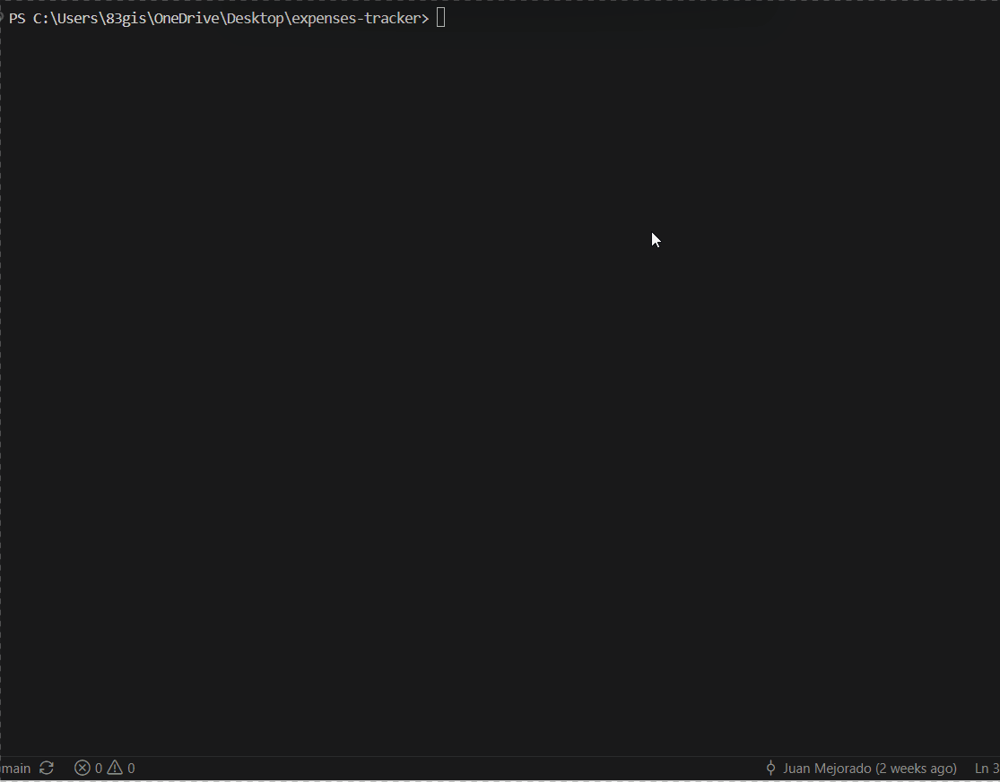

# Python Expense Tracker

A command-line expense tracking application built with **Python** and **SQLite**. This project demonstrates object-oriented programming, modular software design, CRUD operations, relational database integration, file export, and Git/GitHub version control.

The application allows users to manage personal expenses through a simple command-line interface while persisting data in a SQLite database.

---

## Demo



## Features

- Add new expenses
- View all expenses in a formatted table
- Edit existing expenses
- Delete expenses
- Search expenses by description
- Filter expenses by category
- View expense statistics
  - Total spending
  - Average expense
  - Highest expense
  - Lowest expense

- Export expenses to CSV
- Persistent data storage using SQLite
- Input validation for user entries
- Modular project architecture

---

## Technologies Used

- Python
- SQLite
- CSV
- Git
- GitHub

---

## Project Structure

```text
expense-tracker/
│
├── main.py                # Program entry point
├── expense.py             # Expense model
├── expense_manager.py     # Business logic
├── database.py            # SQLite database operations
├── storage.py             # CSV export functionality
├── input_helpers.py       # Input validation and helper functions
├── README.md
└── .gitignore
```

---

## Architecture

The project follows a modular architecture that separates responsibilities into different components.

```text
User Interface (main.py)
            │
            ▼
 Business Logic (expense_manager.py)
            │
            ▼
 Database Layer (database.py)
            │
            ▼
        SQLite Database
```

This separation of concerns makes the project easier to maintain, test, and extend.

---

## Getting Started

### Clone the repository

```bash
git clone <repository-url>
cd expense-tracker
```

### Run the application

```bash
python main.py
```

The application automatically creates the SQLite database (`expenses.db`) the first time it is executed.

---

## Future Improvements

Possible future enhancements include:

- Monthly and yearly expense reports
- Budget planning
- Expense sorting
- Graphical user interface (GUI)
- Data visualization with charts
- Cloud synchronization
- Multi-user support

---

## Author

**Juan Mejorado**

Software Engineering student at The University of Texas at Arlington.

This project is part of my software engineering portfolio and reflects my continued growth in software engineering, object-oriented programming, database design, and software architecture.
